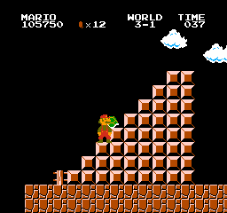
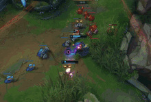
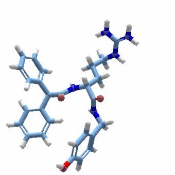

<!-- _paginate: skip -->
# Lecture 1: Foundations of Game Design and CHI PLAY Research

Scott Bateman
University of New Brunswick

@ Université de Lille

### December 13, 2024
---
# About Scott
 - Associate Professor - University of New Brunswick

 - Scientific Director of Research Institute for Artificial Intelligence and Data Science

 - Director of SPECTRAL Spatial Computing Research Centre

 - Director of the Human-Computer Interaction Lab

 2012 - PhD - University of Saskatchewan - Carl Gutwin and Gordon McCalla
2001 - BSc - University of Prince Edward Island

---
# Scott's Research
 - human-computer interaction 
 - mixed reality
 - serious games 
 - interaction techniques 
 
with applications in: 
 
 - healthcare
 - skills training 
 - collaborative work, and
 - entertainment
---

---

---

# Plan for Two Lectures
 1. Today - Lecture 1: Foundations of Game Design and Research
 2. Next Week - Lecture 2: Tour of Research in Games and Play in HCI
---
# Lecture 1: Foundations of Game Design

**Part 1.** Introduction to Game Design Principles
**Part 2.** Advanced Game Design Concepts
**Part 3.** Evaluating Play Experience in Games

---
# Part 1. Introduction to Game Design Principles
 1. Basic Definitions
 2. Overview of the MDA Framework
 3. Case Study of MDA
---
# Why research games?

- a huge global business ($177 800 000 000 euros in 2024)
- it is applied HCI
- game designers/developers are inventive 
- game game designers/developers are interested in our research
- lessons can be used in non-gaming contexts: serious games and gamification
___ 
# What are play, games and video games?
---
# 1.1 What are play, games and video games?
## *A videogame is a game which we play thanks to an audiovisual apparatus and which can be based on a story.* 

 - Nicola Esposito, "A Short and Simple Definition of What a Videogame Is," in Proceedings of DiGRA 2005 Conference: Changing Views: Worlds in Play, 2005.
---
# The relationship between play, games, and video games

<!-- Can you think of an example that is play but not a game in Minecraft -->
---

<!-- minecraft can be played like lego 
 - games balance both structure and rules and the ability to be creative and to explore and express oneselve to different levels.
-->
---
# Play/Player Experience 

 - the emotional, cognitive, and social interactions that players undergo while engaging with a game

 - Many components:
    - Emotional engagement
    - Experience of challenge
    - Expression of creativity
    - Expression of skill
    - Feeling of immersion 
    - Social engagement (real or virtual)

___
# 1.2 MDA: Mechanics, Dynamics, Aesthetics
 ---
# MDA: Mechanics, Dynamics, Aesthetics

A leading framework for connecting the relationship between game design and player experience.

 - *Robin Hunicke, Marc LeBlanc, and Robert Zubek. "MDA: A formal approach to game design and game research." Proceedings of the AAAI Workshop on Challenges in Game AI. Vol. 4. No. 1. 2004.*

---
# MDA: Mechanics, Dynamics, Aesthetics

 - Mechanics: The rules and systems of the game.
 - Dynamics: The runtime behavior of those systems during play.
 - Aesthetics: The emotional responses evoked in players.

---
# Mechanics: The Building Blocks
**Definition**: Mechanics are the foundational rules, systems, and features that govern how the game operates. They define the possible actions and interactions within the game world.

Examples of Mechanics:

- **Core Mechanics**: Basic actions like jumping, running, shooting, or crafting.
- **Progression Systems**: Levels, skill trees, or upgrades.
- **Reward Systems**: Points, collectibles, achievements, or loot.
---
# Design Considerations for Mechanics
 1.	Clarity and Consistency:
    - Rules should be clear and intuitive.
    - **Example**: In *Portal*, the mechanics of the portal gun are introduced progressively to ensure understanding.

    
---
# Design Considerations for Mechanics
2. Balance:
 - Mechanics should create fair and challenging gameplay.
 - **Example**: Chess balances different piece abilities to ensure no one piece dominates.
---
# Design Considerations for Mechanics
3. Innovation:
 - Unique mechanics can set a game apart.
 - **Example**: The time-reversal mechanic in *Braid* redefines puzzle-solving.

 

---
# Dynamics: The Behavior in Action
**Definition**: Dynamics describe how the mechanics interact with each other and with players during gameplay, creating the run-time behavior of the game.

**Examples of Dynamics**:
 - **Player-Driven Interactions**: Multiplayer dynamics such as alliances or betrayals in *Among Us*.
 - **Challenge and Adaptation**: The interaction of mechanics creating varied levels of difficulty in *Dark Souls*.
 - **Emergent Strategies**: Players discovering unintended solutions, like speedrunning shortcuts in *Super Mario Brothers*.

---
# Design Considerations for Dynamics

1. Player Behavior:
    - Designers anticipate how players will engage with mechanics and adjust dynamics to encourage desired behaviors.
    - Example: In *The Sims*, resource management dynamics guide players toward strategic planning.

    

---
# Design Considerations for Dynamics
2. Balancing Complexity:
    - Overlapping systems should create depth without overwhelming the player.
    - Example: *Stardew Valley* balances farming, socializing, and exploration.

    
---
# Design Considerations for Dynamics
3.	Testing and Refinement:
    - Dynamics must be playtested extensively to avoid unintended frustrations.
    - Example: Adjusting AI behavior in *Left 4 Dead* to maintain tension.
---
# Aesthetics: The Player Experience

**Definition**: Aesthetics refer to the emotional and experiential aspects of gameplay—how the game makes players feel.

Examples of Aesthetics (there are more than this):
 - **Sensation**: The thrill of fast-paced action or stunning visuals (*Forza Horizon*).
 - **Narrative**: Emotional connection through storytelling (*The Last of Us*).
 - **Challenge**: The satisfaction of overcoming difficult obstacles (*Celeste*).
 - **Fellowship**: Social connections in multiplayer games (*World of Warcraft*).
 - **Discovery**: The joy of exploring new environments (*Breath of the Wild*).
 - **Expression**: The ability to express oneself creatively. (*Minecraft*)
---
# Design Considerations for Aesthetics

1. Target Emotions:
    - Designers aim for specific emotional responses.
    - **Example**: *Journey* creates a sense of wonder and serenity through minimalist design.
---
# Design Considerations for Aesthetics

2. Immersion:
    - Combining visuals, sound, and mechanics to draw players into the game world.
    - **Example**: The atmospheric horror of *Dead Space* relies on audio-visual cues.
---
# Design Considerations for Aesthetics
3. Player Feedback:
    - Immediate, clear feedback enhances aesthetics (e.g., satisfying sound effects when collecting coins in *Super Mario*).
---
# Interconnections Between MDA Components

- Mechanics Shape Dynamics:
    - Example: The portal gun mechanic in *Portal* directly influences puzzle-solving dynamics.
- Dynamics Shape Aesthetics:
    - Example: The emergent teamwork in *Overwatch* fosters the aesthetic of fellowship.
 - Aesthetics Influence Mechanics:
    - Designers work backward from desired player emotions to define mechanics.
    - Example: To evoke tension in *Dark Souls*, mechanics are designed to penalize failure heavily.
---
# Applying MDA
1.	**Iterative Design Process**:
    - Test how mechanics influence dynamics and adjust to create desired aesthetics.
    - Example: In *Celeste*, mechanics (tight platforming controls) were refined to ensure the aesthetic of mastery and challenge.
2. **Player-Centered Approach**:
    - Understanding the target audience’s preferences helps shape each MDA component.
    - Example: A family-friendly game might prioritize aesthetics like fun and fellowship (*Mario Party*).
3. **Evaluation and Refinement**:
    - Use playtesting and feedback to ensure MDA elements align and enhance the intended experience.
---

# 1.3 Analyzing *Super Mario Bros.* Using the MDA Framework

---
# Mechanics of Super Mario Bros.
- **Core Mechanics**: 
  - Running, jumping, and stomping enemies.
  - Collecting coins, power-ups (e.g., mushrooms, fire flowers).
  - Timer enforcing level completion speed.
- **Rules**:
  - Player loses a life if they touch an enemy without power-ups or fall into a pit.
  - Levels progress sequentially, culminating in a final challenge.
- **Reward Systems**:
  - Extra lives for collecting 100 coins or finding hidden 1-up mushrooms.
  - Power-ups enhance abilities (e.g., fireballs for ranged attacks).
---
# Dynamics of Super Mario Brothers
- **Emergent Player Behavior**:
  - **Risk-reward strategies**: Players decide whether to take time collecting coins or rushing to the goal for a higher score.
  - **Speedrunning**: Players experiment with skipping parts of levels or optimizing movement to complete levels as quickly as possible.

---
# Speedrunning

---
# Dynamics of Super Mario Brothers
- **Interactions Between Mechanics**:
  - Jumping mechanics combined with environmental obstacles create dynamic challenges (e.g., avoiding pits or timing jumps over enemies).
  - Hidden mechanics, such as the ability to crouch-slide or use warp zones, encourage exploration and replayability.

---

# Aesthetics of Super Mario Bros
- **Sensation**: 
  - The thrill of fast-paced movement and precise jumps.
  - Satisfaction from defeating enemies, collecting rewards, or completing levels quickly.
- **Challenge**:
  - Players feel a sense of accomplishment upon clearing difficult sections or levels.
- **Discovery**:
  - Hidden blocks, warp zones, and secret paths evoke curiosity and reward exploration.
- **Fantasy**:
  - Immersive world with a whimsical, colorful setting that supports the idea of a heroic quest.
---
# Summary of MDA
- **Mechanics** provide clear and simple rules that are easy to learn but allow for depth in mastery.
- **Dynamics** emerge from player experimentation and interaction with the environment, fostering engagement and replayability.
- **Aesthetics** ensure that the game remains fun and emotionally satisfying, appealing to a wide audience with its balance of challenge, discovery, and whimsy.
___
# Part 2: Advanced Game Design Concepts (40 minutes)
 1. Understanding Player Motivations 
 2. Game Feel and Player Satisfaction 
 3. Psychological Foundations: Self-Determination Theory
 4. Gamification and Serious Games
---
# 2.1 Understanding Player Motivations
---
# Understanding Player Motivations: Bartle’s Player Types

Richard Bartle's taxonomy of player types categorizes players based on  motivations and behaviors in multiplayer online games. Originally developed for MUDs (Multi-User Dungeons). 

This is just one among many, but it is the first and most well known characterization of player motivations in games.

---

# The Four Player Types

1. **Achievers**:
   - **Motivation**: Driven by goals, rewards, and a sense of accomplishment.
   - **Behavior**: Focus on completing tasks, earning achievements, and mastering the game.
   - **Design Considerations**:
     - Include progression systems, leaderboards, and challenging objectives.
     - Example: Players who strive to reach max level or complete every quest in *World of Warcraft*.

     
---
# The Four Player Types

2. **Explorers**:
   - **Motivation**: Enjoy discovering new areas, mechanics, and secrets within the game.
   - **Behavior**: Engage in thorough exploration and experimentation.
   - **Design Considerations**:
     - Provide expansive, interactive worlds with hidden content and lore.
     - Example: Players who uncover every corner of the map in *Breath of the Wild*.

      
---
# The Four Player Types

3. **Socializers**:
   - **Motivation**: Seek connection and interaction with others.
   - **Behavior**: Value relationships and teamwork over the game itself.
   - **Design Considerations**:
     - Foster community with chat systems, multiplayer modes, and cooperative gameplay.
     - Example: Players who join guilds or spend time chatting in *Animal Crossing*.

     
---
# The Four Player Types

4. **Killers**:
   - **Motivation**: Thrive on competition and dominating other players.
   - **Behavior**: Seek to test their skills against others and win.
   - **Design Considerations**:
     - Include competitive features like PvP (player versus player) modes and rankings.
     - Example: Players focused on climbing the ranks in *League of Legends*.

     
---

# Applying Bartle’s Player Types in Game Design

1. **Balancing Player Motivations**:
   - Successful games often appeal to multiple player types simultaneously.
   - Example: *World of Warcraft* combines achievements (for Achievers), exploration (for Explorers), guild systems (for Socializers), and PvP (for Killers).

---
# Applying Bartle’s Player Types in Game Design
2. **Customizing Experiences**:
   - Designers can tailor games to specific audiences by focusing on certain player types.
   - Example: A narrative-driven game like *Firewatch* caters primarily to Explorers and Socializers.
   
---
# Applying Bartle’s Player Types in Game Design
3. **Adapting to Player Evolution**:
   - Players’ preferences may shift over time, and games should provide flexibility.
   - Example: A Socializer may become an Achiever after learning the game’s mechanics.

---

# Criticism and Extensions of Bartle’s Model

1. **Limitations**:
   - The model is less effective for single-player games or hybrid experiences.
   - Players often exhibit traits from multiple categories, making strict classification challenging.

2. **Extensions**:
   - Newer models, such as the Hexad Player Types, build on Bartle’s framework to include additional motivations like Philanthropy and Expression.

<!--
### **Discussion Questions for Students**
1. Which player type do you identify with most? Why?
2. How can a game you’ve played successfully (or unsuccessfully) balance these player types?
3. Can you think of a game that primarily caters to one player type? How does it achieve that focus?

-->
---
# 2.2. Game Experience Concepts
---
# Game Experience Concepts
Game experience is shaped by the interplay of various design elements that influence how players perceive and interact with a game. Key concepts like **game feel**, **juiciness**, **immersion**, **embodiment**, and **flow** provide theoretical frameworks for understanding how games create engaging and memorable experiences.

---
# Key Concepts in Game Experience

1. Immersion
2. Embodiment
3. Flow
4. Game Feel
5. Juciness

---

# 1. Immersion
- **Definition**: Immersion refers to the player's sense of being completely absorbed in the game world, losing awareness of the real world.
- **Theoretical Background**:
   - Immersion is a cornerstone of digital entertainment, supported by theories of *presence* (the sense of being "there").
   - It combines visual, auditory, and narrative elements to create a cohesive experience.

---
# 1. Immersion
- **Types of Immersion**:
  - **Sensory Immersion**: Focused on audiovisual fidelity (e.g., *Red Dead Redemption 2*’s environmental design).
  - **Cognitive Immersion**: Engagement with the story or solving complex problems (e.g., *The Witcher 3*’s narrative depth).
  - **Emotional Immersion**: Emotional investment in characters or outcomes (e.g., *The Last of Us*).

  
---
# 1. Immersion
- **Design Techniques**:
  - Use cohesive aesthetics, soundscapes, and narratives.
  - Minimize distractions such as overly complex UIs or dissonant mechanics.
- **Examples**:
  - *Journey*: Seamless transitions and evocative visuals create a meditative experience.
  - *The Legend of Zelda: Breath of the Wild*: Encourages exploration with a richly designed open world.

---

# 2. Embodiment
- **Definition**: Embodiment in games refers to the sense of physical and psychological immersion that makes players feel connected to their avatars or the game world.
- **Theoretical Background**:
  - Embodiment is grounded in *phenomenology* (philosophy of experience) and *embodied cognition*, which argue that perception and action are deeply intertwined.
  - The concept explores how players project their sense of self into a virtual character or space.
---
# 2. Embodiment
- **Types of Embodiment**:
  - **Avatar Embodiment**: Feeling as though you "inhabit" your character (e.g., *Mirror’s Edge* creates a visceral sense of movement through first-person parkour).
  - **Environmental Embodiment**: Immersion in the game world (e.g., *Breath of the Wild* encourages exploration through tactile environmental design). Related to the *sense of presence*.
  - **Tool Embodiment**: Treating game tools as extensions of the player (e.g., *Portal*’s portal gun becomes an integral part of how players interact with the game).

  
---
# 2. Embodiment
- **Design Techniques**:
  - Use of perspective (e.g., first-person vs. third-person) to enhance connection.
  - Feedback systems like camera shake, sound design, and physics that mimic real-world sensations.
- **Examples**:
  - *Half-Life: Alyx* (VR): Advanced hand-tracking and environmental interaction immerse players deeply in the game world.
  - *Journey*: Minimalistic character design and seamless controls foster a sense of unity with the game’s flow.

---
# Embodiment
# in Half Life: Alyx

---

# 3. Flow
- **Definition**: Flow is a state of deep focus and enjoyment, where players are fully engaged, and challenges align with their skill level.
- **Theoretical Background**:
  - Based on Mihaly Csikszentmihalyi’s theory of flow, which describes optimal experiences where individuals lose themselves in an activity.
  - Flow is achieved when difficulty and skill are balanced, creating a sense of achievement and control.
---
<!-- _backgroundColor: white-->

---
# 3. Flow
- **Characteristics of Flow**:
  - Clear goals and immediate feedback.
  - Merging of action and awareness.
  - A feeling of control over the game environment.
- **Design Techniques**:
  - Gradually increase difficulty to match player progression.
  - Use audio-visual cues to signal success or failure.
- **Examples**:
  - *Tetris*: Increasing difficulty keeps players engaged as they improve.
  - *Dark Souls*: High-risk, high-reward gameplay encourages mastery and persistence.

---
# 4. Game Feel
- **Definition**: *Game feel* refers to the tactile, sensory, and emotional feedback players experience during interaction with a game. It is often described as the "soul" of a game’s controls.
- **Theoretical Background**:
  - Game feel emerges from the relationship between input (what the player does) and output (how the game responds).
  - Theories of *embodied cognition* suggest that game feel is rooted in how players physically and mentally connect with the game's systems.

---
# 4. Game Feel
- **Design Elements of Game Feel**:
  - **Input Responsiveness**: Precision and immediacy of controls (e.g., minimal input lag).
  - **Feedback Loops**: Audio, visual, and haptic cues that provide instant responses to player actions.
  - **Simulation**: Realistic or exaggerated physics that make interactions satisfying.
- **Examples**:
  - *Celeste*: Tight controls ensure players feel in complete control, even during challenging sequences.
  - *Super Mario Brothers*: The jump mechanics are fine-tuned to make every leap feel natural and rewarding.

---
# Game Feel in Celeste

---
# 5. Juiciness
- **Definition**: Juiciness refers to the richness and responsiveness of a game's feedback systems, making even simple interactions feel rewarding and impactful. Very much related to *Game feel*.
- **Theoretical Background**:
  - Juiciness is tied to the concept of *reinforcement loops* in psychology, where positive feedback encourages continued engagement.
  - The term gained popularity in game design communities as a way to describe "over-the-top feedback" that enhances player satisfaction.

Watch this: https://www.youtube.com/watch?v=Fy0aCDmgnxg

---
# 5. Juiciness
- **Key Attributes of Juiciness**:
  - **Layered Feedback**: Visual, auditory, and sometimes haptic effects layered onto actions.
  - **Exaggeration**: Amplified responses to player input, such as particle effects or celebratory sounds.
  - **Flow**: Encourages players to stay in the game by making every interaction satisfying.
- **Examples**:
  - *Angry Birds*: Destructive feedback when structures collapse, combined with humorous sound effects, creates a sense of delight.
  - *Peggle*: Over-the-top celebrations when completing levels, with colorful visuals and triumphant music.

---

# Synthesis of Game Design Concepts
- **Interconnected Design Elements**:
  - **Immersion** draws players into the game world.
  - **Embodiment** connects players with characters and environments.
  - **Flow** sustains engagement by aligning challenge and skill.
  - **Game Feel** provides tactile satisfaction.
  - **Juiciness** enriches interactions with layered feedback.

<!--
### **Discussion Questions**
1. Can you identify a game where you’ve experienced all these elements working together? What made it memorable?
2. How does embodiment differ from immersion in terms of player experience? Can you think of examples that excel in one but not the other?
3. What role does flow play in long-term engagement? Share examples of games that balance it well.
-->
---

# Conclusion
Game experience concepts like game feel, juiciness, immersion, embodiment, and flow provide theoretical and practical tools for designing engaging games. By understanding and applying these principles, designers can craft experiences that are both emotionally resonant and deeply satisfying.

---
# 2.3 Psychological Foundations: Self-Determination Theory (SDT)
---
# Psychological Foundations: Self-Determination Theory (SDT)

SDT explains how intrinsic motivation is driven by the fulfillment of three basic psychological needs: **autonomy**, **competence**, and **relatedness**. Gamification and serious games leverage these principles to engage users effectively.

---

# 1. SDT: Autonomy
- **Definition**: The need to feel in control of one’s actions and decisions.
- **Application in Games**:
  - Open-world exploration in *Breath of the Wild*, where players choose their path and goals.
  - Gamified apps like Duolingo allow users to select lessons or topics of interest.
- **Importance**:
  - Enhances intrinsic motivation by fostering a sense of ownership and freedom.
  - Encourages creativity and experimentation.

---

# 2. SDT: Competence
- **Definition**: The need to feel effective and capable when interacting with the environment.
- **Application in Games**:
  - Skill-based progression systems, such as leveling up in *World of Warcraft*.
  - Challenge levels in gamified fitness apps like Zombies, Run!, where users feel rewarded for achieving milestones.
- **Importance**:
  - Provides a sense of achievement and mastery.
  - Encourages continued engagement by aligning challenges with skill level.

---

# 3. SDT: Relatedness
- **Definition**: The need to feel connected to others and experience meaningful relationships.
- **Application in Games**:
  - Cooperative gameplay in *Overwatch*, where teamwork is essential.
  - Social features in gamified platforms like Fitbit, which encourage friendly competition and collaboration.
- **Importance**:
  - Fosters community and social bonds, which enhance emotional investment.
  - Motivates sustained engagement through social accountability and connection.
---

# 2.4: Gamification and Serious Games

---

# Gamification: Applying Game Mechanics in Non-Gaming Contexts

Gamification involves the use of game elements, such as points, leaderboards, and challenges, in non-game contexts to engage users, motivate behavior, and enhance experiences. This approach has been widely adopted in fields such as education, healthcare, and workplace productivity.

---

# Key Components of Gamification
1. **Game Elements**:
   - **Points and Rewards**: Provide instant feedback and motivation (e.g., frequent flyer miles, badges).
   - **Challenges**: Encourage goal-oriented behavior (e.g., Duolingo’s daily streaks).
   - **Leaderboards**: Foster competition and social comparison (e.g., Fitbit’s step challenges).

   
---
# Key Components of Gamification
2. **Psychological Foundations**:
   - **Self-Determination Theory (SDT)**:
     - Gamification satisfies intrinsic needs for autonomy, competence, and relatedness.
   - **Behavioral Reinforcement**:
     - Positive feedback loops incentivize specific actions.
---

# 3. Gamification Applications:
   - **Education**: Platforms like Duolingo use gamification to make language learning engaging.
   - **Healthcare**: Apps like Zombies, Run! encourage physical activity by integrating storytelling and goals.
   - **Workplace**: Commercial software like Saleforce use gamified elements to improve employee engagement.

---

# Gamification: Criticisms and Challenges:
- Overuse of extrinsic rewards can undermine intrinsic motivation (e.g., gamification fatigue).
- Poorly designed systems may feel manipulative or fail to engage users.

---

# Serious Games: Games with Purpose

Serious games are designed primarily for purposes beyond entertainment, such as education, training, and raising awareness. They often blend entertainment with real-world objectives, leveraging the engaging nature of games to achieve meaningful outcomes.

---

# Characteristics of Serious Games
1. **Purpose-Driven Design**:
   - Focus on achieving non-entertainment goals, such as learning or behavior change.
2. **Blend of Fun and Functionality**:
   - Games must remain engaging to ensure player retention and goal achievement.
---

# Applications of Serious Games
1. **Education**:
   - Games like *Foldit* teach biochemistry by challenging players to solve protein folding puzzles.
   - *Minecraft: Education Edition* helps students learn math, science, and coding concepts.
2. **Game for Therapy**:
   - Games like *SPARX* are designed to help teenagers manage depression.
   - Virtual reality simulations assist in pain management and rehabilitation.
   
---
# Applications of Serious Games

3. **Professional Training**:
   - Simulations like *X-Plane* are used to train pilots.
   - Games for medical training provide realistic, risk-free environments for practicing surgical procedures.
4. **Social Awareness**:
   - Games like *Papers, Please* raise awareness about political and ethical dilemmas in border control.

---
# Design Principles of Serious Games
- **Engagement**: Balance educational or training content with entertaining mechanics.
- **Feedback Loops**: Provide actionable feedback to reinforce learning or skill acquisition.
- **Realism**: Incorporate authentic scenarios to enhance relevance and immersion.

---

# Key Differences Between Gamification and Serious Games
| **Aspect**             | **Gamification**                                     | **Serious Games**                                   |
|-------------------------|-----------------------------------------------------|----------------------------------------------------|
| **Primary Goal**        | Enhance engagement and motivate learning in non-game contexts             | Support educational, training, or awareness goals |
| **Use of Game Elements**| Selectively incorporates game mechanics             | Fully integrates game systems                     |
| **Audience**            | General users across various fields                 | Learners, professionals, or targeted communities  |
| **Examples**            | Duolingo, Fitbit                                    | SPARX, Foldit, Papers, Please                     |

---

# Summary of Gamification & Serious Game
Gamification and serious games demonstrate the power of game design principles in achieving real-world impact. While gamification selectively applies game mechanics to non-game contexts, serious games integrate these mechanics to create purposeful and engaging experiences. By leveraging insights from research and design, both approaches can inspire meaningful change and learning.

<!--
### **Discussion Questions**
1. What gamified applications have you used? Were they effective in motivating you?
2. Can you identify a serious game that successfully balanced engagement with its real-world purpose?
3. How can designers ensure that gamification and serious games remain ethical and inclusive?
-->
---
# Part 3. Evaluating Play Experience
 1. Play Testing
 2. Player Experience Inventory
---
# 3.1. Play Testing: Understanding  Player Experience
---
# Play Testing: Understanding  Player Experience

Play testing is a critical phase in game development where designers observe players interacting with the game to identify strengths, weaknesses, and areas for improvement. 

Unlike traditional HCI experimentation, play testing focuses less on standardized usability metrics and more on subjective engagement and player behavior within the dynamic systems of a game.

---
# How Play Testing Differs from Traditional HCI Experimentation

1. **Focus on Engagement**:
   - HCI experimentation often emphasizes efficiency, accuracy, and task completion.
   - Play testing prioritizes player enjoyment, immersion, and emotional responses.
---
# How Play Testing Differs 

2. **Iterative Creative Process**:
   - HCI studies typically aim to validate hypotheses or measure performance metrics.
   - Play testing is a fluid, iterative process where findings directly inform design changes to enhance the player experience.

   
---
# How Play Testing Differs from Traditional HCI Experimentation

3. **Emergent Behavior**:
   - HCI experimentation tends to focus on pre-defined tasks and workflows.
   - Play testing encourages players to explore freely, uncovering emergent behaviors and unexpected dynamics.
---
# How Play Testing Differs from Traditional HCI Experimentation

4. **Subjective Feedback**:
   - HCI experiments often rely on objective measures (e.g., time-on-task).
   - Play testing combines observation with qualitative feedback, such as players’ emotional reactions and perceived satisfaction.
---
<!-- _backgroundColor: white  -->

 from: https://www.playerresearch.com/what-we-do/

---

# Practical Example

In *Portal*, early play testing revealed players were confused about the portal gun's mechanics. This led to a redesign of tutorial levels, and mechanics were introduced incrementally to ensure understanding.

---

# 3.2 Player Experience Inventory (PXI)
https://playerexperienceinventory.org/

---
# Player Experience Inventory (PXI)
- The most recent of many validated questionaires used in games research to understand and characterize play experience

**Purpose**
- The PXI is designed to measure player experiences at two levels:
  1. **Functional Consequences**: Immediate and tangible experiences directly resulting from game design (e.g., ease of control, audiovisual appeal).
  2. **Psychosocial Consequences**: Emotional and higher-order responses elicited through gameplay (e.g., immersion, autonomy).

--- 
# Constructs of the PXI
- **Functional Consequences**:
  - Ease of Control
  - Challenge
  - Progress Feedback
  - Goals and Rules
  - Audiovisual Appeal
- **Psychosocial Consequences**:
  - Meaning
  - Immersion
  - Mastery
  - Curiosity
  - Autonomy

---

# Practical Applications of the PXI
- Academic Research:
  - Supports the study of causal relationships between game mechanics and player experiences.
- Industry:
  - Provides rapid feedback for iterative game design cycles.

---

## Summary of PXI
- A robust and validated measurement tool for Games User Research (GUR).
- Bridges the gap between functional gameplay mechanics and higher-order emotional experiences.
- A concise 30-item questionnaire covering 10 constructs.

https://playerexperienceinventory.org/

*Vero Vanden Abeele, Katta Spiel, Lennart Nacke, Daniel Johnson, Kathrin Gerling,
Development and validation of the player experience inventory: A scale to measure player experiences at the level of functional and psychosocial consequences,
International Journal of Human-Computer Studies, Volume 135, 2020, https://doi.org/10.1016/j.ijhcs.2019.102370.*

---
# Conclusion and Questions?

---

# Activity: Evaluating Play Experience with Adding Juice and Adding Improving Game Feel

---

# Activity Details

 - We have two games that we will be able to make either juicy or non-juicy. 

 - The goal is by the end of the class, we have versions of each of the two games that are the best in terms of Juiciness. 

 - Everyone in the class will then play both versions of the game and complete the PXI questionnaire after playing each game for 5 minutes. 

 - To create the Juicy games you can work alone or with a partner. 

 - Scott will select the best version of the game from the class for playing. 

---

# Game #1: Breakout - find the best juice!

This is a recreation of Breakout created by Martin Jonasson & Petri Purho for their talk "Juice it or lose it", presented at Nordic Game, 2012.  

https://www.youtube.com/watch?v=Fy0aCDmgnxg

The game is for Godot 4.3 and can be downloaded from here:
https://github.com/scottbateman/godot-juicy-breakout

You have 20 minutes to play around and select the best version that contains juicy features that make the best version of the game.

Scott will choose the 'best' version and we will play test it later.

---
# Game #2: Super Mario Bros. - create the best game feel!

The second game is a recreation of the original Super Mario Bros for Unity.

It is purposefully not very good, so that you can improve the game feel.

Before you start create a new branch for your development, so that you can easily switch back to the old version for the play test.

You have 50 minutes to create the best version you can.

 - Reference version: https://jcw87.github.io/c2-smb1/

 - Repository: https://github.com/scottbateman/unity-super-mario

---
# Experiment Time

 - Play the two version of each game for 5 minutes each:
    - Breakout
      - Version 1: No Juice
      - Version 2: The Best Combintation

    - Super Mario
      - Version 1: The Original Unity Project
      - Version 2: The Best Version

    Immediately afterwards complete the PXI: 
    https://forms.office.com/r/932fuZqCPt

- Results to be presented next week